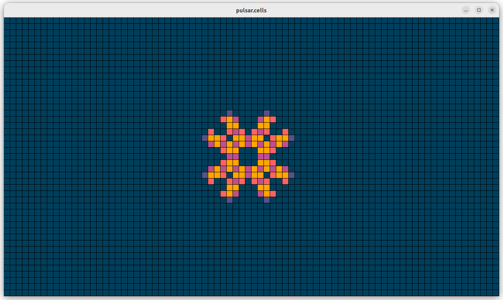

# game-of-life
C++ implementation of [Conway's Game of Life](https://conwaylife.com/wiki/Conway%27s_Game_of_Life) with [SFML](https://www.sfml-dev.org/index.php) graphics.

## Features

- Implemented using [SFML 3.0](https://github.com/SFML/SFML), which is standardized on C++17.
- Reads [plaintext](https://conwaylife.com/wiki/Plaintext) and [RLE](https://conwaylife.com/wiki/Run_Length_Encoded) pattern formats.
- Supports finite plane or 'infinite' grids via the `--wrapped` command line option.
- Supports random [soups](https://conwaylife.com/wiki/Soup#Soup_search) via the `--random` command line option.
- For pattern files, adaptively reduces the tiling size (from the nominal 16x16) in powers of 2 increments to support patterns up to 640x360.
- Colorizes the cell [transitions](https://en.wikipedia.org/wiki/Conway%27s_Game_of_Life) rather than just showing live or dead.
- Cell colors can be configured via JSON
- Display parameters (screen size, tile size) can be configured via JSON.



## Dependencies

This project uses a hybrid dependency management approach:

### Conan Dependencies
- **nlohmann_json** - JSON parsing for configuration files
- **GTest** - Unit testing framework

### CMake FetchContent Dependencies
- **SFML 3.0** - Graphics and windowing library
- **effolkronium/random** - Modern C++ random number generation
- **cxxopts** - Command-line argument parsing

## Building

### Prerequisites

**Ubuntu 24.04:**
```bash
# Install build tools
sudo apt install cmake build-essential

# Install pip and Conan
sudo apt install pipx
pipx ensurepath
pipx install conan

# Install SFML build dependencies
sudo apt install libx11-dev libxrandr-dev libxcursor-dev libxi-dev \
                 libudev-dev libgl1-mesa-dev libfreetype6-dev \
                 libopenal-dev libvorbis-dev libflac-dev

# 1. Clone the repository
git clone <repository-url>
cd game-of-life

# 2. Install Conan dependencies
conan install . --output-folder=build --build=missing

# 3. Configure CMake with Conan toolchain
cmake -B build -DCMAKE_TOOLCHAIN_FILE=build/conan_toolchain.cmake -DCMAKE_BUILD_TYPE=Release

# 4. Build the project
cmake --build build -j$(nproc)

# 5. Run the executable
./build/game_of_life [options]

# 6. Run tests
./build/gol_unit_tests
